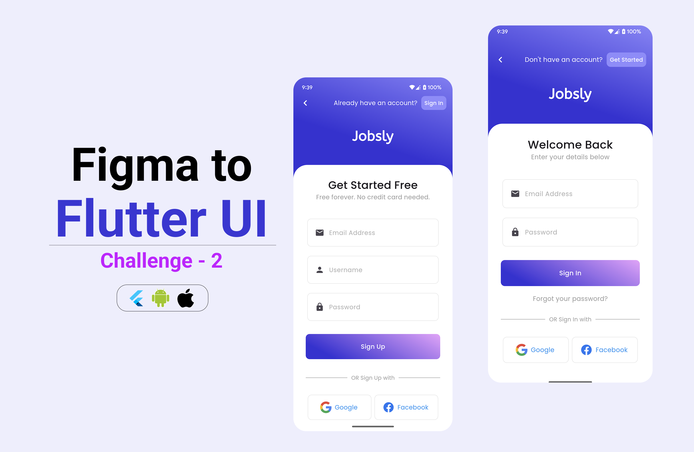

## 🚀 Figma to Flutter UI Challenge - 2 🎨➡️📱

As a Flutter learner, I picked a random UI design from Dribbble and challenged myself to bring it to life in Flutter! 🛠️ This helped me practice UI development and level up my Flutter skills. 

💡 What I Learned: 
✅ Breaking down UI into reusable Flutter widgets 
✅ Managing layout and responsiveness effectively 
✅ Choosing the right Flutter components 
✅ Working with Cards and MediaQuery for a better adaptive design 

## 🌟 Screenshots

  

